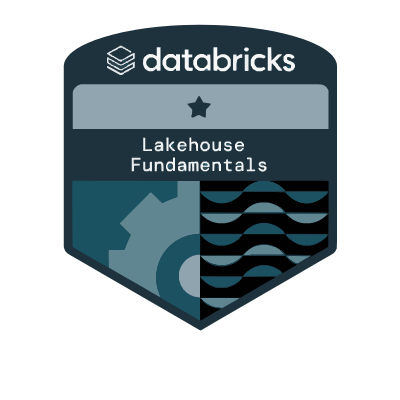

<h2 align="left">Olá 👋  Muito obrigado pela visita em meu perfil ! ❤ É um prazer te receber por aqui 🙌✔</h2>

<h2 align="left">Sobre mim</h2>

Meu nome é Christopher, tenho 31 anos, moro em São Paulo, Capital, na região de Santo Amaro, e estou estagiando no Banco Santander como Quality Assurance, também conhecido como Tester!- Estou desenvolvendo tanto testes manuais quanto automação em aplicações web com Java.

Sou o Fundador da Loja Virtual de Venda de Livros Odontologicos e Instrumentais Cirurgicos, Odonto Book Store.

<h5 align="left">
✨ Iniciei meus estudos em tecnologia a partir de Junho de 2022 ... 
📚 Atualmente estou aprofundando meus conhecimentos em automação de testes... 
🎯 Tornar-me um Engenheiro de Automação competente e aprimorar minhas habilidades... 
🎲 Um fato curioso, sou formado em aviação civil! 
🌱 Eu sou um eterno aprendiz, fique à vontade para entrar em contato comigo!  
☄ Em um futuro próximo quero iniciar uma tese de Mestrado em tecnologia.
</h5>

<h4 align="left">GitHub Stats:</h4>

  
  

<h3 align="left">🛠 Linguagens de Programação</h3>

  
  
  
  
  
  

<h3 align="left">✔ Frameworks de Teste:</h3>

  
  
  
  

<h3 align="left">⚔ Principais IDEs:</h3>

  
  

<h3 align="left">💻 Terminais CLI:</h3>

  
  

<h3 align="left">🛸 CI/CD Tools:</h3>

  
  

<h3 align="left">👔 Documentação:</h3>

  
  

<h3 align="left">📌 Outras Tecnologias:</h3>

  
  

<h3 align="left">Experiência de Trabalho:</h3>

<h3 align="left"> Experiência de trabalho :  </h3>

Na visão geral abaixo você encontrará minhas experiências de trabalho mais recente:

**Estagiário em Ti - Qualidade de Software Web - Tester** \
[**Santander**](https://www.santander.com.br/) • Part-time • Desde Maio 2024 \
Linguagens & Tecnologias: `Java`, `Selenium`, `SQL`, `Cucumber`, `Jira`, `Octane` \
Projetos em destaque: [Obsolescência](https://www.santander.com.br/), [Finanças TI - Gestão Contábil](https://www.santander.com.br/)

 

**OdontoBookStore - Desenvolvedor Web** 
[**Odonto Book Store**](https://odontobookstore.com.br/) • Fundador desde Abril 2023 \
Linguagens & Tecnologias: `WordPress`, `WooCommerce`,`Elementor`, `MySQL`\
Projetos em destaque: [E-commerce](https://odontobookstore.com.br/), [Api MarketPlace](https://odontobookstore.com.br/), [Elementor PRO](https://odontobookstore.com.br/)
<h3 align="left">Selos/Badges:</h3>

  
  
  
  

        

<!-- Contatos e Contagem de Visitas -->

  
  
  
  
  

<picture align="center">
  <source media="(prefers-color-scheme: dark)" srcset="https://raw.githubusercontent.com/ChristopherADS/ChristopherADS/output/github-contribution-grid-s

   
<picture align="center">
  <source media="(prefers-color-scheme: dark)" srcset="https://raw.githubusercontent.com/ChristopherADS/ChristopherADS/output/github-contribution-grid-snake-dark.svg">
  <source media="(prefers-color-scheme: light)" srcset="https://raw.githubusercontent.com/ChristopherADS/ChristopherADS/output/github-contribution-grid-snake-dark.svg">
  
</picture>

  <h3><b>📍 Contagem de visitas do perfil ! 📍 </b></h3>

  

 

